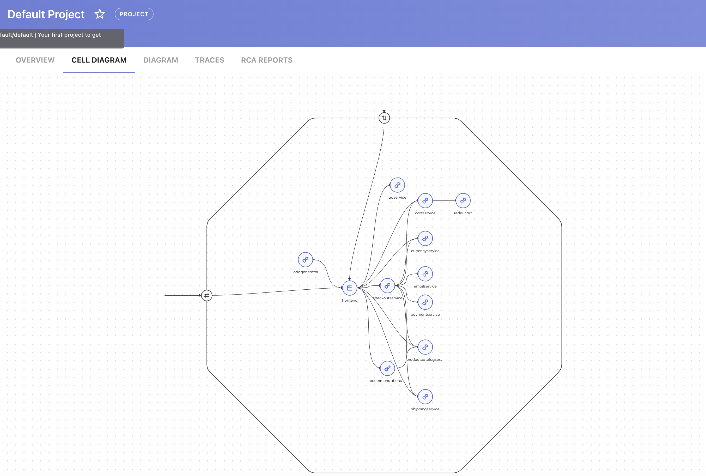
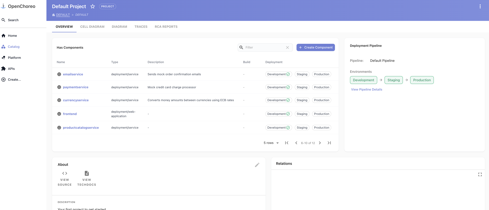
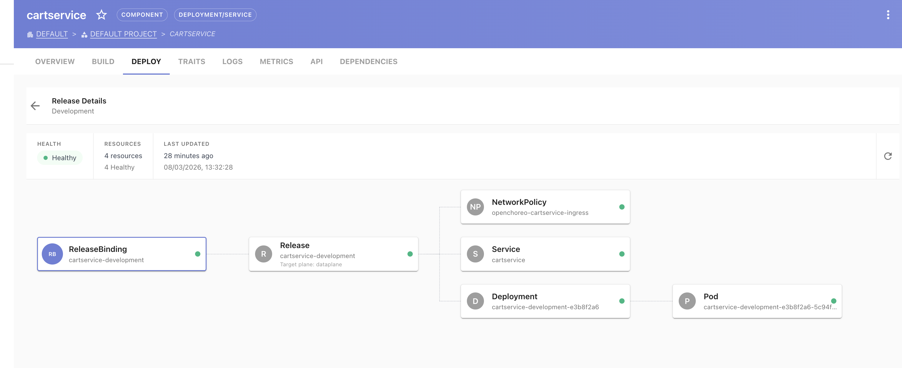
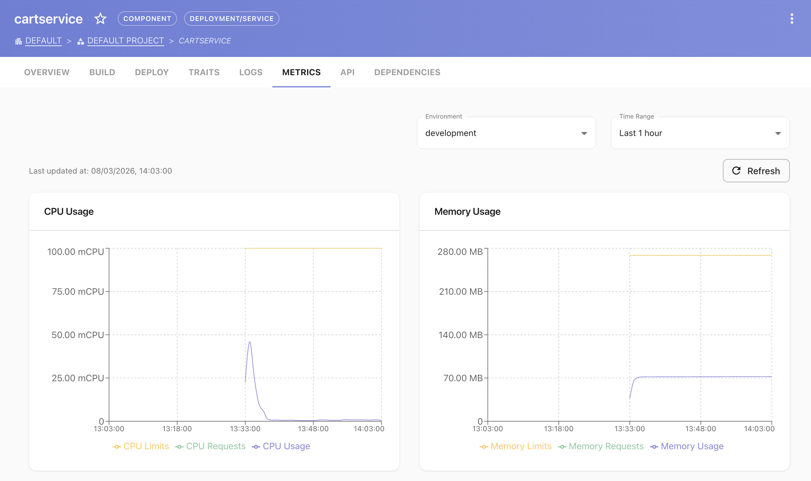

# Sample: Deploy Google Microservices Demo on OpenChoreo

This sample shows how to deploy the [Google Cloud Platform Online Boutique (microservices-demo)](https://github.com/GoogleCloudPlatform/microservices-demo) — a 12-service e-commerce application — onto OpenChoreo using Claude Code with the `openchoreo-developer` and `openchoreo-platform-engineer` skills and the `openchoreo-cp` MCP server.

---

## What this sample covers

- Mapping 12 heterogeneous microservices to OpenChoreo ComponentTypes
- BYOI (Bring Your Own Image) deployment using pre-built Google images
- Service-to-service wiring using OpenChoreo `dependencies` and `envBindings` instead of hardcoded env vars
- gRPC and HTTP endpoints declared natively
- Port remapping (emailservice svc:5000 → container:8080)
- `worker` ComponentType for the Locust load generator
- External HTTP exposure of the frontend via `visibility: [external]`
- Discovering and working around MCP tool limitations at runtime (bugs noted below are fixed in current MCP server)

---

## Prerequisites

| Requirement | Notes |
|---|---|
| Claude Code with skills loaded | Both `openchoreo-developer` and `openchoreo-platform-engineer` from this repo |
| `openchoreo-cp` MCP server registered | See [MCP configuration guide](https://openchoreo.dev/docs/reference/mcp-servers/mcp-ai-configuration/) |
| OpenChoreo v0.17 cluster | With at least one DataPlane, `development` environment, and the `service` / `web-application` / `worker` ComponentTypes registered |
| Access to the OpenChoreo REST API | Optional fallback; `create_workload` MCP tool is now fixed in current versions |

---

## The prompt

Copy and paste this single prompt into Claude Code to reproduce the full deployment:

```
Using the currently registered OpenChoreo MCP servers, along with the Platform Engineer
and Developer skills, can you figure out how to deploy

    https://github.com/GoogleCloudPlatform/microservices-demo

into OpenChoreo while mapping it to the Platform Engineer and Developer concepts?
```

That is the entire prompt. Claude will:

1. Activate both skills
2. Fetch the microservices-demo repo manifest in a background agent
3. Query the live cluster (ComponentTypes, Traits, Environments, Pipeline) in parallel
4. Produce a full mapping and deployment plan
5. Ask for confirmation, then execute the plan

When Claude asks "Want me to start executing the MCP calls now, beginning with Tier 1?" — answer **yes**.

---

## What Claude does (step by step)

### Phase 1 — Research (parallel)
- Fetches `kubernetes-manifests.yaml` and `README.md` from the GitHub repo via a background sub-agent
- Simultaneously queries the cluster: `list_cluster_component_types`, `list_cluster_traits`, `list_environments`, `list_deployment_pipelines`, `list_workflows`, `list_component_types`

### Phase 2 — Mapping plan
Produces a full mapping table:

| Service | Language | ComponentType | Rationale |
|---|---|---|---|
| frontend | Go | `web-application` | Only externally-facing HTTP UI |
| checkoutservice | Go | `service` | Internal gRPC orchestrator |
| productcatalogservice | Go | `service` | Internal gRPC |
| shippingservice | Go | `service` | Internal gRPC |
| currencyservice | Node.js | `service` | Internal gRPC, highest QPS |
| paymentservice | Node.js | `service` | Internal gRPC |
| emailservice | Python | `service` | Internal gRPC, port remap 5000→8080 |
| recommendationservice | Python | `service` | Internal gRPC |
| cartservice | C# | `service` | Internal gRPC, depends on Redis |
| adservice | Java | `service` | Internal gRPC |
| redis-cart | Redis | `service` | BYOI infra, Deployment-backed |
| loadgenerator | Python/Locust | `worker` | No exposed ports, background traffic |

### Phase 3 — Workload schema discovery
Calls `get_workload_schema` to discover:
- Env var key field is `key` (not `name`)
- `gRPC` is a valid endpoint type
- `dependencies` with `envBindings` is the native way to inject service addresses
- `visibility: [external]` on an endpoint routes through the gateway

### Phase 4 — Deployment (tiered, dependency order)

```
Tier 1 (parallel): redis-cart, currencyservice, paymentservice,
                   shippingservice, emailservice, adservice
Tier 2 (parallel): productcatalogservice, cartservice, recommendationservice
Tier 3:            checkoutservice
Tier 4:            frontend
Tier 5:            loadgenerator
```

Each tier: create Component → create Workload → verify `status: Ready`.

### Phase 5 — Verify
- `list_release_bindings` confirms all 12 services bound to `development`
- Frontend ReleaseBinding shows `ConnectionsResolved: True` (all 7 connections)
- External URL resolved from binding status

---

## Results

| Metric | Value |
|---|---|
| Services deployed | 12 / 12 |
| All components Ready | Yes |
| Frontend external URL | `http://http-frontend-development-default-<hash>.openchoreoapis.localhost:19080` |
| Frontend connections resolved | 7 / 7 |
| Deployment time (first component → all Ready) | ~9 min 22 sec |
| Main session tool uses | ~75 |
| MCP tool bugs encountered | 2 (see below — both fixed in current MCP server) |

---

## Known issues and workarounds discovered during this run

> **Status:** Both issues below have been fixed in the current MCP server. `create_workload` now works correctly. The `dependencies` must still be an array (issue #2 was a documentation/schema bug, not a runtime bug).

### 1. `create_workload` MCP tool — missing workload name derivation *(fixed)*

**Symptom (at time of this run):** Every call to `mcp__openchoreo-cp__create_workload` failed with:
```
failed to check workload existence: checking existence of workload default/: resource name may not be empty
```

**Root cause:** The MCP tool's server-side handler did not derive the workload name from `component_name` before checking for an existing workload.

**Current behavior:** Fixed. Use `create_workload` directly — no REST API workaround needed. The tool now accepts `namespace_name`, `component_name`, and `workload_spec`.

**Legacy workaround (for older server versions):** Call the OpenChoreo REST API directly:

```bash
TOKEN=$(curl -k -s -X POST "$AUTH_URL/oauth2/token" \
  -H 'Content-Type: application/x-www-form-urlencoded' \
  -u 'service_mcp_client:service_mcp_client_secret' \
  -d 'grant_type=client_credentials' | jq -r '.access_token')

curl -s -X POST "$API_BASE/api/v1/namespaces/default/workloads" \
  -H "Authorization: Bearer $TOKEN" \
  -H "Content-Type: application/json" \
  -d '{
    "metadata": {"name": "<component-name>", "namespace": "default"},
    "spec": {
      "owner": {"componentName": "<component-name>", "projectName": "default"},
      "container": {"image": "<image>"},
      "endpoints": { ... },
      "dependencies": [ ... ]
    }
  }'
```

### 2. `get_workload_schema` — dependencies reported as map, API expects array

**Symptom:** Workloads with dependencies fail with:
```
can't decode JSON body: json: cannot unmarshal object into Go struct field
WorkloadSpec.spec.dependencies of type []gen.WorkloadDependency
```

**Root cause:** `get_workload_schema` returns dependencies as a JSON object (map). The actual API requires an **array**.

**Correct format:**
```json
"dependencies": [
  {
    "component": "productcatalogservice",
    "endpoint": "grpc",
    "visibility": "project",
    "envBindings": {"address": "PRODUCT_CATALOG_SERVICE_ADDR"}
  }
]
```

**Wrong format (as reported by schema):**
```json
"dependencies": {
  "productcatalogservice": {
    "component": "productcatalogservice",
    ...
  }
}
```

---

## Complete workload specs for reference

All images: `us-central1-docker.pkg.dev/google-samples/microservices-demo/<name>:v0.10.4`
Redis: `redis:alpine`

### Tier 1 — No outbound connections

```json
// redis-cart
{"container": {"image": "redis:alpine"}, "endpoints": {"redis": {"type": "TCP", "port": 6379, "visibility": ["project"]}}}

// currencyservice
{"container": {"image": ".../currencyservice:v0.10.4", "env": [{"key": "PORT", "value": "7000"}, {"key": "DISABLE_PROFILER", "value": "1"}]}, "endpoints": {"grpc": {"type": "gRPC", "port": 7000, "visibility": ["project"]}}}

// paymentservice
{"container": {"image": ".../paymentservice:v0.10.4", "env": [{"key": "PORT", "value": "50051"}, {"key": "DISABLE_PROFILER", "value": "1"}]}, "endpoints": {"grpc": {"type": "gRPC", "port": 50051, "visibility": ["project"]}}}

// shippingservice
{"container": {"image": ".../shippingservice:v0.10.4", "env": [{"key": "PORT", "value": "50051"}, {"key": "DISABLE_PROFILER", "value": "1"}]}, "endpoints": {"grpc": {"type": "gRPC", "port": 50051, "visibility": ["project"]}}}

// emailservice — port remap: svc 5000 → container 8080
{"container": {"image": ".../emailservice:v0.10.4", "env": [{"key": "PORT", "value": "8080"}, {"key": "DISABLE_PROFILER", "value": "1"}]}, "endpoints": {"grpc": {"type": "gRPC", "port": 5000, "targetPort": 8080, "visibility": ["project"]}}}

// adservice
{"container": {"image": ".../adservice:v0.10.4", "env": [{"key": "PORT", "value": "9555"}]}, "endpoints": {"grpc": {"type": "gRPC", "port": 9555, "visibility": ["project"]}}}
```

### Tier 2

```json
// productcatalogservice
{"container": {"image": ".../productcatalogservice:v0.10.4", "env": [{"key": "PORT", "value": "3550"}, {"key": "DISABLE_PROFILER", "value": "1"}]}, "endpoints": {"grpc": {"type": "gRPC", "port": 3550, "visibility": ["project"]}}}

// cartservice
{"container": {"image": ".../cartservice:v0.10.4"}, "endpoints": {"grpc": {"type": "gRPC", "port": 7070, "visibility": ["project"]}},
 "dependencies": [{"component": "redis-cart", "endpoint": "redis", "visibility": "project", "envBindings": {"address": "REDIS_ADDR"}}]}

// recommendationservice
{"container": {"image": ".../recommendationservice:v0.10.4", "env": [{"key": "PORT", "value": "8080"}, {"key": "DISABLE_PROFILER", "value": "1"}]}, "endpoints": {"grpc": {"type": "gRPC", "port": 8080, "visibility": ["project"]}},
 "dependencies": [{"component": "productcatalogservice", "endpoint": "grpc", "visibility": "project", "envBindings": {"address": "PRODUCT_CATALOG_SERVICE_ADDR"}}]}
```

### Tier 3

```json
// checkoutservice
{"container": {"image": ".../checkoutservice:v0.10.4", "env": [{"key": "PORT", "value": "5050"}]},
 "endpoints": {"grpc": {"type": "gRPC", "port": 5050, "visibility": ["project"]}},
 "dependencies": [
   {"component": "productcatalogservice", "endpoint": "grpc", "visibility": "project", "envBindings": {"address": "PRODUCT_CATALOG_SERVICE_ADDR"}},
   {"component": "shippingservice",       "endpoint": "grpc", "visibility": "project", "envBindings": {"address": "SHIPPING_SERVICE_ADDR"}},
   {"component": "paymentservice",        "endpoint": "grpc", "visibility": "project", "envBindings": {"address": "PAYMENT_SERVICE_ADDR"}},
   {"component": "emailservice",          "endpoint": "grpc", "visibility": "project", "envBindings": {"address": "EMAIL_SERVICE_ADDR"}},
   {"component": "currencyservice",       "endpoint": "grpc", "visibility": "project", "envBindings": {"address": "CURRENCY_SERVICE_ADDR"}},
   {"component": "cartservice",           "endpoint": "grpc", "visibility": "project", "envBindings": {"address": "CART_SERVICE_ADDR"}}
 ]}
```

### Tier 4

```json
// frontend — visibility: external exposes through the gateway
{"container": {"image": ".../frontend:v0.10.4", "env": [{"key": "PORT", "value": "8080"}, {"key": "ENABLE_PROFILER", "value": "0"}]},
 "endpoints": {"http": {"type": "HTTP", "port": 8080, "visibility": ["external"]}},
 "dependencies": [
   {"component": "productcatalogservice",  "endpoint": "grpc", "visibility": "project", "envBindings": {"address": "PRODUCT_CATALOG_SERVICE_ADDR"}},
   {"component": "currencyservice",        "endpoint": "grpc", "visibility": "project", "envBindings": {"address": "CURRENCY_SERVICE_ADDR"}},
   {"component": "cartservice",            "endpoint": "grpc", "visibility": "project", "envBindings": {"address": "CART_SERVICE_ADDR"}},
   {"component": "recommendationservice",  "endpoint": "grpc", "visibility": "project", "envBindings": {"address": "RECOMMENDATION_SERVICE_ADDR"}},
   {"component": "shippingservice",        "endpoint": "grpc", "visibility": "project", "envBindings": {"address": "SHIPPING_SERVICE_ADDR"}},
   {"component": "checkoutservice",        "endpoint": "grpc", "visibility": "project", "envBindings": {"address": "CHECKOUT_SERVICE_ADDR"}},
   {"component": "adservice",              "endpoint": "grpc", "visibility": "project", "envBindings": {"address": "AD_SERVICE_ADDR"}}
 ]}
```

### Tier 5

```json
// loadgenerator — worker, no endpoints exposed
{"container": {"image": ".../loadgenerator:v0.10.4", "env": [{"key": "USERS", "value": "10"}, {"key": "RATE", "value": "1"}]},
 "dependencies": [{"component": "frontend", "endpoint": "http", "visibility": "project", "envBindings": {"address": "FRONTEND_ADDR"}}]}
```

---

## Screenshots

### Cell diagram — auto-generated service topology

OpenChoreo automatically generates a cell diagram showing all 12 components and their connection graph. This is visible in the project view after all components are deployed.



> **To capture:** Open the OpenChoreo console → select the `default` project → the topology/cell view renders the full graph automatically from the declared `dependencies`.

---

### Component list — all 12 services Ready

The components view shows every deployed service with its type, status, and latest release hash.



> **To capture:** OpenChoreo console → Components tab → filter by project `default`.

---

### Cart Service ReleaseBinding — connection to Redis resolved

The ReleaseBinding detail for `cartservice` shows the `redis-cart` connection resolved and the `REDIS_ADDR` env var injected by the platform.



> **To capture:** OpenChoreo console → Components → `cartservice` → Deployments → `development` binding.

---

### Observability — component logs and metrics (optional)

If the `openchoreo-obs` MCP server is configured and an ObservabilityPlane is registered, the observer UI shows per-component logs, HTTP metrics, and traces.



> **To capture:** OpenChoreo console → Components → `frontend` → Observability tab.

---

## Tips for reuse

- **Use BYOI for demos and migrations** — skip source builds entirely when public images are available
- **Name components exactly as the original service names** — OpenChoreo injects DNS names based on component names; matching the original names means env var expectations often work without changes
- **Use `dependencies` + `envBindings` over hardcoded addresses** — the platform resolves addresses at deploy time and handles environment promotion automatically
- **`visibility: [external]` on one endpoint is enough for gateway exposure** — the platform wires the gateway automatically, no additional Trait needed (in a default single-cluster setup)
- **`targetPort` handles port remapping** — use it when the Kubernetes Service port differs from the container listen port (as with emailservice)
- **`worker` ComponentType for traffic generators / sidecars** — anything with no exposed endpoints and no inbound traffic fits the worker type
- **Deploy in dependency order** — leaf services first, orchestrators last; OpenChoreo doesn't enforce ordering but dependencies fail to resolve if the target component hasn't been created yet
