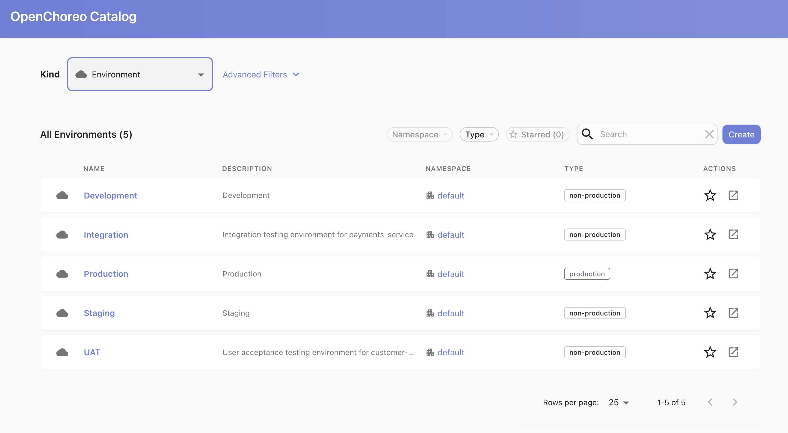
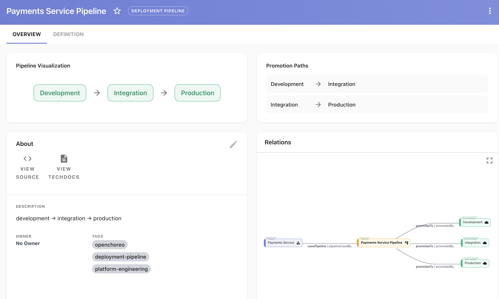
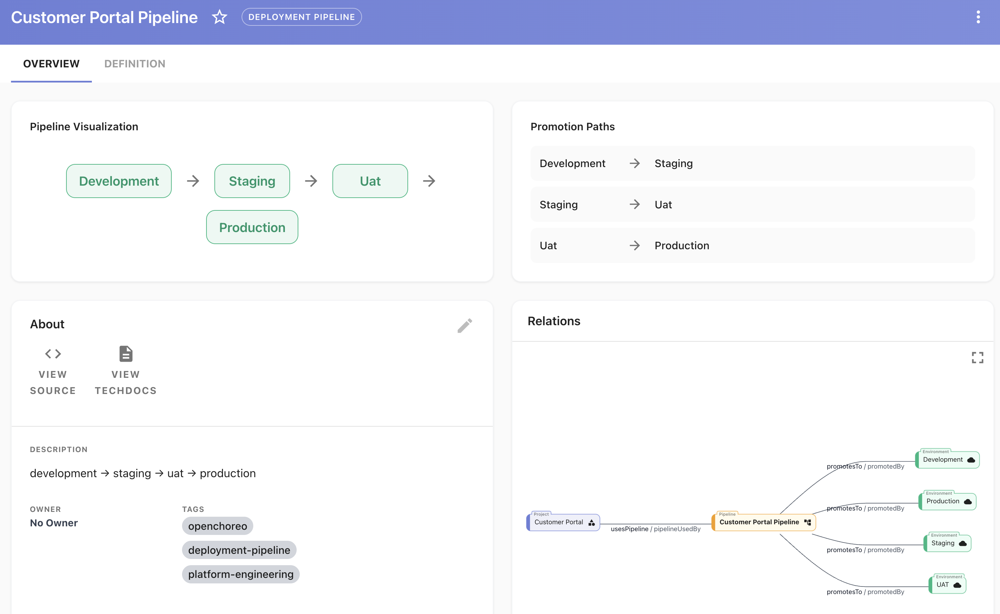
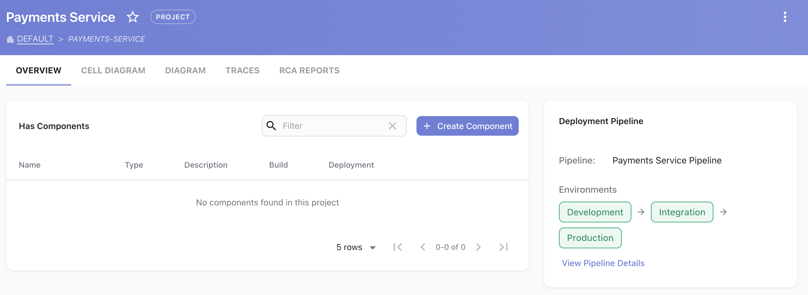
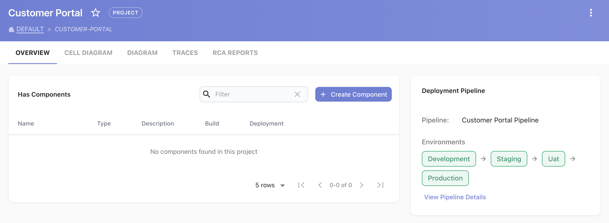

# Sample: Onboarding New Teams to OpenChoreo with a Single Prompt

This sample shows how a **Platform Engineer** can onboard multiple new teams to OpenChoreo — creating environments, deployment pipelines, and projects with correct pipeline assignments — using Claude Code with the `openchoreo-platform-engineer` skill and the `openchoreo-cp` MCP server.

Two teams are onboarded end-to-end from a single natural-language prompt:

| Team | Environments | Pipeline |
|------|-------------|---------|
| **payments-service** | dev → integration → production | `payments-service-pipeline` |
| **customer-portal** | dev → staging → UAT → production | `customer-portal-pipeline` |

---

## Why this matters

Onboarding a new team to an internal developer platform traditionally requires:

- Manual YAML authoring for environments, pipelines, and projects
- Knowledge of the platform's resource model (Environment, DeploymentPipeline, Project, DataPlane refs)
- CLI access and correct context configuration
- Risk of pipeline mis-assignment (especially with `create_project` defaulting to the wrong pipeline)

With OpenChoreo skills and the MCP server connected, a Platform Engineer describes what they need in plain English. Claude handles discovery, YAML generation, sequenced `occ apply` calls, and MCP-based verification — all in under 2 minutes.

---

## Prerequisites

| Requirement | Notes |
|---|---|
| Claude Code with skills loaded | `openchoreo-platform-engineer` from this repo |
| `openchoreo-cp` MCP server registered | See [MCP configuration guide](https://openchoreo.dev/docs/reference/mcp-servers/mcp-ai-configuration/) |
| `occ` CLI installed and logged in | See [CLI installation guide](https://openchoreo.dev/docs/user-guide/cli-installation/) |
| OpenChoreo v0.17+ cluster | With at least one DataPlane and a `default` namespace |

---

## The prompt

Copy and paste this single prompt into Claude Code to reproduce the full onboarding:

```
We are onboarding two new teams to the platform: payments-service and customer-portal.
The payments-service team requires dev, integration, and production environments.
The customer-portal team requires dev, staging, UAT, and production environments.
Using the available Platform Engineer skills in the system, provision the required
infrastructure, create the environments, and attach them to the corresponding projects
using the default platform templates and policies.
```

That is the entire prompt. No YAML, no CLI commands, no resource names — just the intent.

---

## What Claude does (step by step)

### Phase 1 — Discover current platform state (parallel MCP calls)

Claude immediately queries the live cluster using MCP tools in parallel:

- `list_namespaces` — confirms the active namespace (`default`)
- `list_environments` — finds existing environments (`development`, `staging`, `production`)
- `list_deployment_pipelines` — finds the existing `default` pipeline
- `list_projects` — confirms no payments-service or customer-portal projects yet

**Time: ~5 seconds**

### Phase 2 — Plan the delta

Claude compares what exists against what was requested and identifies:

- `integration` environment — needs to be created (new)
- `uat` environment — needs to be created (new)
- `development`, `staging`, `production` — already exist, reuse them
- `payments-service-pipeline` — needs to be created (dev → integration → prod)
- `customer-portal-pipeline` — needs to be created (dev → staging → uat → prod)
- `payments-service` project — needs to be created with correct pipeline ref
- `customer-portal` project — needs to be created with correct pipeline ref

**No over-provisioning. No duplicate environment creation.**

### Phase 3 — Create environments via occ apply

Two new environments are created sequentially (since `create_environment` is not available as an MCP tool):

```bash
# integration environment
occ apply -f /tmp/env-integration.yaml

# uat environment
occ apply -f /tmp/env-uat.yaml
```

Each YAML includes:
- `dataPlaneRef` pointing to the `default` DataPlane
- `isProduction: false` for non-prod environments
- Display name and description annotations

**Time: ~10 seconds**

### Phase 4 — Create deployment pipelines via occ apply

Two custom pipelines are created:

```bash
# payments-service: dev → integration → production
occ apply -f /tmp/pipeline-payments-service.yaml

# customer-portal: dev → staging → uat → production
occ apply -f /tmp/pipeline-customer-portal.yaml
```

Each pipeline encodes the full promotion path including `requiresApproval` policy per hop.

**Time: ~10 seconds**

### Phase 5 — Create projects with correct pipeline assignment

Projects are created via `occ apply` or via the MCP `create_project` tool with the `deployment_pipeline` parameter. Using `occ apply` gives full control over the pipeline assignment at creation time:

```bash
# payments-service project → payments-service-pipeline
occ apply -f /tmp/project-payments-service.yaml

# customer-portal project → customer-portal-pipeline
occ apply -f /tmp/project-customer-portal.yaml
```

**Time: ~10 seconds**

### Phase 6 — Verify via MCP

Claude verifies all resources are visible on the live cluster:

- `list_environments` — confirms `integration` and `uat` are present
- `list_deployment_pipelines` — confirms both custom pipelines
- `list_projects` — confirms both projects with correct `deploymentPipelineRef`

**Time: ~5 seconds**

---

## Total time and resource usage

| Metric | Value |
|--------|-------|
| **Wall-clock time** | ~2 minutes |
| **Human keystrokes** | 1 prompt paste |
| **Resources created** | 2 environments, 2 pipelines, 2 projects |
| **Errors / retries** | 0 |
| **Claude model** | Claude Sonnet 4.6 |
| **Token usage (approx)** | less than 2k tokens (input + output across all tool calls) |

> **Comparison**: Doing this manually — writing 6 YAML files, running 6 `occ apply` commands, and verifying in the UI — typically takes 15–30 minutes for a PE who knows the resource model, and longer for anyone unfamiliar with the `deploymentPipelineRef` gotcha or the `occ apply -f -` stdin limitation.

---

## Resources created

### Environments

| Name | Display Name | Type | DataPlane |
|------|-------------|------|-----------|
| `integration` | Integration | non-production | default |
| `uat` | UAT | non-production | default |

(Reused from platform: `development`, `staging`, `production`)

### Deployment pipelines

**payments-service-pipeline**

```
development  →  integration  →  production
```

**customer-portal-pipeline**

```
development  →  staging  →  uat  →  production
```

### Projects

| Project | Pipeline assigned |
|---------|------------------|
| `payments-service` | `payments-service-pipeline` |
| `customer-portal` | `customer-portal-pipeline` |

---

## Screenshots

### Environments page — all environments including the two new ones



### Deployment pipelines — payments-service-pipeline



### Deployment pipelines — customer-portal-pipeline



### Project view — payments-service with pipeline assignment



### Project view — customer-portal with pipeline assignment



---

## YAML reference

All YAML files used in this sample:

### environment-integration.yaml

```yaml
apiVersion: openchoreo.dev/v1alpha1
kind: Environment
metadata:
  name: integration
  namespace: default
  labels:
    openchoreo.dev/name: integration
  annotations:
    openchoreo.dev/display-name: Integration
    openchoreo.dev/description: Integration testing environment for payments-service
spec:
  dataPlaneRef:
    kind: DataPlane
    name: default
  isProduction: false
```

### environment-uat.yaml

```yaml
apiVersion: openchoreo.dev/v1alpha1
kind: Environment
metadata:
  name: uat
  namespace: default
  labels:
    openchoreo.dev/name: uat
  annotations:
    openchoreo.dev/display-name: UAT
    openchoreo.dev/description: User acceptance testing environment for customer-portal
spec:
  dataPlaneRef:
    kind: DataPlane
    name: default
  isProduction: false
```

### pipeline-payments-service.yaml

```yaml
apiVersion: openchoreo.dev/v1alpha1
kind: DeploymentPipeline
metadata:
  name: payments-service-pipeline
  namespace: default
  annotations:
    openchoreo.dev/display-name: Payments Service Pipeline
    openchoreo.dev/description: "development → integration → production"
spec:
  promotionPaths:
    - sourceEnvironmentRef: development
      targetEnvironmentRefs:
        - name: integration
    - sourceEnvironmentRef: integration
      targetEnvironmentRefs:
        - name: production
```

### pipeline-customer-portal.yaml

```yaml
apiVersion: openchoreo.dev/v1alpha1
kind: DeploymentPipeline
metadata:
  name: customer-portal-pipeline
  namespace: default
  annotations:
    openchoreo.dev/display-name: Customer Portal Pipeline
    openchoreo.dev/description: "development → staging → uat → production"
spec:
  promotionPaths:
    - sourceEnvironmentRef: development
      targetEnvironmentRefs:
        - name: staging
    - sourceEnvironmentRef: staging
      targetEnvironmentRefs:
        - name: uat
    - sourceEnvironmentRef: uat
      targetEnvironmentRefs:
        - name: production
```

### project-payments-service.yaml

```yaml
apiVersion: openchoreo.dev/v1alpha1
kind: Project
metadata:
  name: payments-service
  namespace: default
  annotations:
    openchoreo.dev/display-name: Payments Service
    openchoreo.dev/description: Payments service team project
spec:
  deploymentPipelineRef:
    kind: DeploymentPipeline
    name: payments-service-pipeline
```

### project-customer-portal.yaml

```yaml
apiVersion: openchoreo.dev/v1alpha1
kind: Project
metadata:
  name: customer-portal
  namespace: default
  annotations:
    openchoreo.dev/display-name: Customer Portal
    openchoreo.dev/description: Customer portal team project
spec:
  deploymentPipelineRef:
    kind: DeploymentPipeline
    name: customer-portal-pipeline
```

---

## Key platform insights

### Why occ apply instead of MCP create_project?

The `create_project` MCP tool accepts a `deployment_pipeline` parameter — pass it explicitly to avoid defaulting to `default`. Alternatively, use `occ apply -f` for full control over the YAML including display names and descriptions.

### Why occ apply instead of MCP for environments and pipelines?

`create_environment` and `create_deployment_pipeline` are not available as MCP tools. `occ apply -f` is the supported path for these resources.

### Why write to a temp file instead of piping YAML?

`occ apply -f -` (stdin) returns `path - does not exist`. Always write YAML to a file first (`/tmp/*.yaml`), then apply.

### What does Claude reuse vs create?

Claude queries the live cluster first, finds existing shared environments (`development`, `staging`, `production`), and reuses them in the new pipelines. It only creates what is genuinely new. This prevents environment sprawl.

---

## Adapting this sample for your organisation

To onboard a different team, change the prompt's team names and environment lists. Everything else — discovery, YAML generation, sequencing, verification — is handled by Claude automatically.

Example variations:

```
We are onboarding a new team called data-platform.
They need development, testing, and production environments.
Create the infrastructure and attach it to a project.
```

```
We are onboarding a new team called mobile-backend.
They need dev, canary, and production environments with approval required
before promoting to production.
Create the infrastructure and attach it to a project.
```

The skills understand `requiresApproval` in promotion paths — just state it in the prompt.
